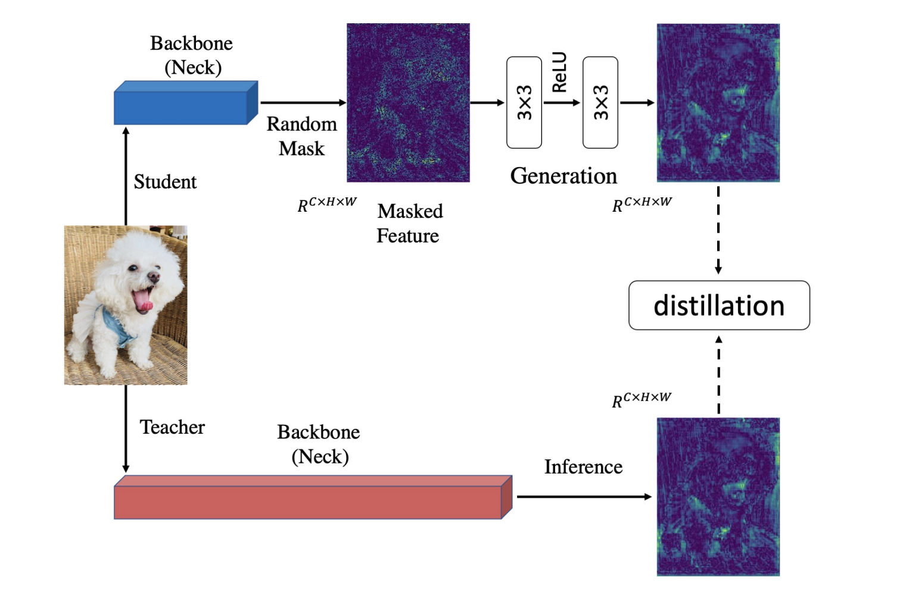

# Interpreting Distillation Across Architectural Paradigms

This repository contains the official PyTorch implementation for our project investigating the transfer of "dark knowledge" and global shape bias from Vision Transformers (ViTs) to Convolutional Neural Networks (CNNs).

## 🏗️ The Architecture: Masked Generative Distillation (MGD)
Standard linear projectors act as a "translation firewall"—they mathematically align features but fail to force the CNN to abandon its reliance on local textures. 

To break this firewall, we treat distillation as an active generative puzzle. By applying a **75% random spatial mask** to the CNN's features, we physically destroy local texture data. To successfully reconstruct the ViT's uncorrupted features, the error gradients must bypass the projector and force the CNN backbone to extract global shape and spatial geometry.

 


## 🚀 Key Contributions
* **Baseline Benchmarking:** Evaluated homogeneous (CNN -> CNN) vs. heterogeneous (ViT -> CNN) distillation.
* **Breaking the Translation Firewall:** Demonstrated that standard linear projectors (PCA/GL) fail to transfer cognitive shape bias.
* **Shape vs. Texture Trade-off:** Proved that our MGD ResNet-18 student successfully traded its native texture bias for a ViT's global shape geometry, validated through Color Jitter and Pencil Sketch anomalies.

## 📊 Key Results (Imagenette)
Our ViT-Taught MGD model achieved state-of-the-art out-of-distribution (OOD) robustness on shape-dependent tasks like Heavy Blur, while successfully collapsing on texture-dependent tasks (Color Jitter), proving the cognitive shift.

| Model Lineage | Clean Accuracy | Heavy Blur (Shape) | Color Jitter (Texture) |
| :--- | :---: | :---: | :---: |
| Supervised Baseline (CNN) | 90.96% | 36.20% | 69.12% |
| CNN-Taught (Homogeneous KD) | 92.33% | 39.41% | 72.36% |
| **ViT-Taught (MGD Heterogeneous)**| **91.72%** | **42.09%** | **64.79%** |

## 📂 Repository Structure
* `train_vit-cnn_mgd.py`: The main training script for our successful Masked Generative Distillation architecture.
* `train_baselines.py`: The training pipeline for standard cross-entropy, homogeneous KD, and the failed PCA/GL projector baselines.
* `experiments.ipynb`: Interactive notebook containing Grad-CAM attention maps and OOD corruption evaluations.
* `history/`: Archive containing previous training iterations, ablation studies, and early experimental variants referenced in the paper's Appendix.

## 🛠️ Quick Start

**1. Install dependencies:**
```bash
pip install -r requirements.txt
```
**2. Train the baseline models (Supervised, CNN-KD, Proj-KD):**

```bash
python train_baselines.py
```

**3. Train the primary MGD model (ViT -> CNN):**
```bash
python train_vit-cnn_mgd.py
```
**4. Evaluate:**

Open `experiments.ipynb` to run the Grad-CAM visualizations and OOD robustness metrics on the saved `.pth` weights.

## 🔬 Ablations & Previous Iterations
In deep learning, knowing what *doesn't* work is just as important as knowing what does. Before finalizing the MGD architecture, we explored several standard KD paradigms which are documented in the `history/` directory and `train_baselines.py`:
* **Pure Logit Distillation:** Scaled poorly across the architectural gap and failed to provide meaningful OOD robustness.
* **Standard Cross-Architecture KD (PCA & Generalized Linear Projectors):** Demonstrated the "translation firewall" effect. The projectors mathematically aligned the $C=256$ (CNN) and $C=384$ (ViT) feature spaces, but failed to force the CNN backbone to physically alter its spatial attention. 
* *Note: These failed baselines are critical to our thesis and are fully detailed in the Appendix of our NeurIPS report.*

## 📚 References & Acknowledgments
This project builds upon foundational and cutting-edge research in knowledge distillation and model robustness:
1. **Hinton, G., et al. (2015).** *Distilling the Knowledge in a Neural Network.* ([arXiv:1503.02531](https://arxiv.org/abs/1503.02531)) - The foundational paper for soft-label dark knowledge.
2. **Yang, Z., et al. (2022).** *Masked Generative Distillation.* ECCV. ([arXiv:2205.01529](https://arxiv.org/abs/2205.01529)) - The core generative masking mechanism utilized to bridge our heterogeneous architectures.
3. **Bhojanapalli, S., et al. (2021).** *Understanding Robustness of Transformers for Image Classification.* ICCV. - The theoretical basis for why ViTs possess superior shape bias and OOD robustness compared to CNNs.
4. **Selvaraju, R. R., et al. (2017).** *Grad-CAM: Visual Explanations from Deep Networks via Gradient-based Localization.* ICCV. - Used for our attention-shift visualizations.